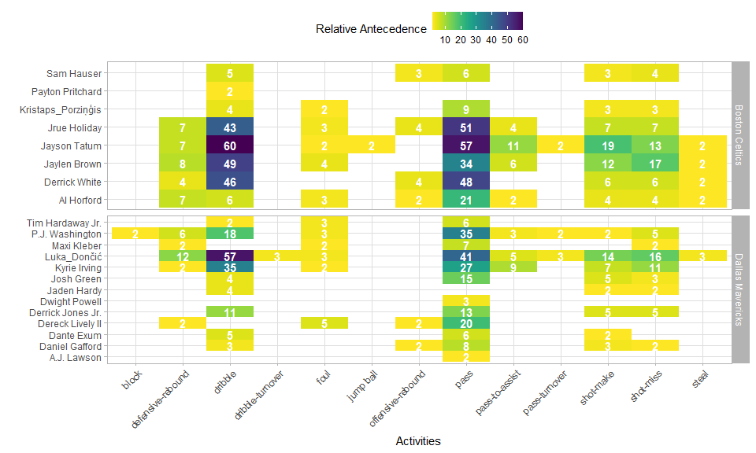

## Project Introduction 👋🏽

Inspired by @PmInspiration, this analysis will use R to explore process mining on a subject I am fond of - basketball. I have played basketball all my life, although my failing left knee means I play infrequently in my older age.

I will be analysing game 5 of the 2024 NBA final between Dončić, Dallas Mavericks and Tatum, Boston Celtics. Well done Celtics 🍀, who last won a championship 16 years ago. I will avoid findings which could just as easily be found in a games summary statistics and focus on what unique insights process mining provides. Let us start with the data.


## Data Treatment

The data collation was a manual effort, a labour of love. After watching game 5 of the 2024 NBA finals I painstakingly noted down each activity along with the timestamp.

To add assurance to this data set I checked each activity available on [@nba.com/play-by-play](https://www.nba.com/game/dal-vs-bos-0042300405/play-by-play?period=All) matched on timestamp and cross checked the summary player stats against [@nba.com/box-score](https://www.nba.com/game/dal-vs-bos-0042300405/box-score?period=All).

A few self imposed rules during data creation:

-   To define the process under analysis, one end to end run or 'case' ends with a shot

-   For free throws the case ends at the last free throw attempt

-   Unless specified from the nba website I have timestamped at the beginning of each activity

**Data is available on [Kaggle](https://www.kaggle.com/datasets/kurtissmith/nba-final-game-5-process-mining) or [Github](https://github.com/KurtisAsha/klog/blob/main/content/blog/nba_final_flow_2024/input/nba-final-2024-game-5.csv)**

## Create Eventlog

An eventlog in process mining is a structured collection of recorded events that represent the execution of activities usually within a business process, in this context, an NBA game.

It typically contains information such as the event type, timestamp, case identifier, and other relevant attributes, serving as the primary input for process mining techniques to discover, monitor, and improve actual processes.

Once an event log object has been created, the object can be used across multiple analyses.


```r
nba_final_g5_eventlog <-  nba_2024_g5_pm_data %>% 
 mutate(lifecycle_id = 'complete', 
        timestamp = ymd_hms(paste0('20240617 ', timestamp))) %>% 
 eventlog(case_id = 'case_id', 
          activity_id = 'activity_id', 
          activity_instance_id = 'seq', 
          lifecycle_id = 'lifecycle_id', 
          timestamp = 'timestamp', 
          resource_id = 'resource_id', 
          order = 'seq', 
          validate = TRUE)
```

## Analyses

### Control-Flow

Control flow in process mining refers to the sequence and decision points of activities within a process. This perspective explores the flow of the game.

#### Traces

Traces are the distinct processes of an eventlog, in this context, a play which starts at the beginning of a quarter of post shot attempt until another shot attempt.

##### Coverage

Reviewing the trace coverage relative to cases let us us see if the same plays are used throughout or if plays are variable. The plots display relative frequencies above 0.02 to remove the plot tail and make for better viewing. 


```r
log_trace <- nba_final_g5_eventlog %>%
 trace_coverage('trace') %>%
 filter(relative > 0.02) %>%
 plot() +
 theme(legend.position = 'top') +
 scale_fill_viridis('Relative Frequency',
                    option = 'D',
                    direction = -1) +
 scale_y_continuous(limits = c(0, 0.45), 
                    breaks = seq(0, 0.45, 0.05)) +
 scale_x_continuous(breaks = seq(0, 1, 0.2)) +
 labs(title = 'Play variance') +
 ylab('')
```

```
## Scale for fill is already present.
## Adding another scale for fill, which will replace the existing scale.
```

```r
united_log_trace <- nba_final_g5_eventlog %>%
 act_unite(
  pass = c(
   'pass-to-assist',
   'pass',
   'pass-turnover',
   'pass-to-start-quarter'
  ),
  dribble = c('dribble', 'dribble-turnover'),
  rebound = c('defensive-rebound', 'offensive-rebound'),
  shot = c('shot-miss', 'shot-make')
 ) %>%
 trace_coverage('trace') %>%
 filter(relative > 0.02) %>%
 plot() +
 theme(legend.position = 'top') +
 scale_fill_viridis('Relative Frequency',
                    option = 'D',
                    direction = -1) +
 scale_y_continuous(limits = c(0, 0.45), 
                    breaks = seq(0, 0.45, 0.05)) +
 scale_x_continuous(breaks = seq(0, 1, 0.2)) +
 labs(title = 'Play variance with unified activities') +
 ylab('')
```

```
## Scale for fill is already present.
## Adding another scale for fill, which will replace the existing scale.
```

```r
 (log_trace + united_log_trace) +
 plot_layout(axes = 'collect')
```

<!-- -->

As the left plot displays a max relative frequency of 0.03, the plays of this game varied considerably. Even when grouping activities e.g. dribble and dribble-turnover both set as dribble, a max relative frequency of 0.06 as shown in the right plot.

With more detailed data around off the ball movements and data on many more games, perhaps you could use trace coverage analysis to: - Indicate if systematic plays are used, shown by an increase in the relative frequency - Compare across teams and games to see if this metric shares patterns with tradition metrics i.e. win/loss, plus/minus etc

##### Team Trace Length

Reviewing the trace sizes for each team i.e. The number of activities used until a shot attempt.


```r
shot_made_plot <- nba_final_g5_eventlog %>%
 filter_activity_presence('shot-make') %>%
 group_by(teams_play) %>%
 trace_length('log') %>%
 plot() +
 theme(strip.background = element_rect(fill = viridis::viridis(1, direction = 1))) +
 geom_jitter(alpha = 0.7, size = 2) +
 geom_boxplot(fill = viridis::viridis(1, alpha = 0.6, direction = -1), 
              colour = '#000000') +
 stat_boxplot(geom = 'errorbar', linetype = 'dashed', width = 0.1) +
 scale_y_continuous(limits = c(0, 18)) +
 labs(title = 'Teams Traces by Shot Made')

shot_miss_plot <- nba_final_g5_eventlog %>%
 filter_activity_presence('shot-miss') %>%
 group_by(teams_play) %>%
 trace_length('log') %>%
 plot() +
 theme(strip.background = element_rect(fill = viridis::viridis(1, direction = 1))) +
 geom_jitter(alpha = 0.7, size = 2) +
 geom_boxplot(fill = viridis::viridis(1, alpha = 0.6, direction = -1), 
              colour = '#000000') +
 stat_boxplot(geom = 'errorbar', linetype = 'dashed', width = 0.1) +
 scale_y_continuous(limits = c(0, 18)) +
 labs(title = 'Teams Traces by Shot Miss')

(shot_made_plot + shot_miss_plot) +
 plot_layout(axes = 'collect')
```

<!-- -->

All look similar except Dallas for plays which end in a miss. Lets look into this further by spliting Dallas traces by quarter.


```r
nba_final_g5_eventlog %>%
 filter(teams_play == 'Dallas Mavericks') %>% 
 filter_activity_presence('shot-miss') %>%
 group_by(quarter) %>% 
 trace_length('log') %>%
 plot() +
 theme(strip.background = element_rect(fill = viridis::viridis(1, direction = 1))) +
 geom_jitter(alpha = 0.7, size = 2) +
 geom_boxplot(fill = viridis::viridis(1, alpha = 0.6, direction = -1), 
              colour = '#000000') +
 stat_boxplot(geom = 'errorbar', linetype = 'dashed', width = 0.1) +
 scale_y_continuous(limits = c(0, 18)) +
 labs(title = 'Dallas Traces by Shot Miss & Quarter')
```

<!-- -->

The 4th quarter has higher average and max trace lengths at a time when they needed to make a push.

There could be multiple reasons as to why, perhaps Boston played brilliant defence forcing Dallas to pass more in order to shift the defence and make space.

Regardless this ran down the clock limiting the number of available opportunities to reduce the deficit.

Let us view that 4th quarter outlier process to see why.


```r
longest_trace <- nba_final_g5_eventlog %>%
 filter(teams_play == 'Dallas Mavericks') %>%
 filter_activity_presence('shot-miss') %>%
 filter_trace_length(percentage = 0.01) %>% 
 count(case_id, sort = TRUE) %>% 
 head(1) %>% 
 pull(case_id)

nba_final_g5_eventlog %>%
 filter_case(cases = longest_trace) %>% 
 as.data.frame() %>% 
 select(case_id, seq, activity_id, player_team, teams_play) %>% 
 datatable(class = c('compact', 'hover', 'row-border'), 
           rownames = FALSE, 
           options = list(dom = 't'))
```

```{=html}
<div class="datatables html-widget html-fill-item" id="htmlwidget-76d4fb019008e370f2b8" style="width:100%;height:auto;"></div>
<script type="application/json" data-for="htmlwidget-76d4fb019008e370f2b8">{"x":{"filter":"none","vertical":false,"data":[["play_149","play_149","play_149","play_149","play_149","play_149","play_149","play_149","play_149","play_149","play_149","play_149","play_149","play_149","play_149","play_149"],[962,963,964,965,966,967,968,969,970,971,972,973,974,975,976,977],["defensive-rebound","pass","dribble","pass","dribble","pass","dribble","foul","turnover","pass","dribble","pass","dribble","pass","pass","shot-miss"],["Boston Celtics","Boston Celtics","Boston Celtics","Boston Celtics","Boston Celtics","Boston Celtics","Boston Celtics","Boston Celtics","Boston Celtics","Dallas Mavericks","Dallas Mavericks","Dallas Mavericks","Dallas Mavericks","Dallas Mavericks","Dallas Mavericks","Dallas Mavericks"],["Dallas Mavericks","Dallas Mavericks","Dallas Mavericks","Dallas Mavericks","Dallas Mavericks","Dallas Mavericks","Dallas Mavericks","Dallas Mavericks","Dallas Mavericks","Dallas Mavericks","Dallas Mavericks","Dallas Mavericks","Dallas Mavericks","Dallas Mavericks","Dallas Mavericks","Dallas Mavericks"]],"container":"<table class=\"compact hover row-border\">\n  <thead>\n    <tr>\n      <th>case_id<\/th>\n      <th>seq<\/th>\n      <th>activity_id<\/th>\n      <th>player_team<\/th>\n      <th>teams_play<\/th>\n    <\/tr>\n  <\/thead>\n<\/table>","options":{"dom":"t","columnDefs":[{"className":"dt-right","targets":1},{"name":"case_id","targets":0},{"name":"seq","targets":1},{"name":"activity_id","targets":2},{"name":"player_team","targets":3},{"name":"teams_play","targets":4}],"order":[],"autoWidth":false,"orderClasses":false},"selection":{"mode":"multiple","selected":null,"target":"row","selectable":null}},"evals":[],"jsHooks":[]}</script>
```

This outlier is explained by how a play is defined by a shot attempt. Boston held position at the onset but turned over possession to Dallas, shortly after Dallas made a shot attempt.

#### Precedences

Reviewing the activity process matrix allows for investigation into antecedent and consequential activities. Each activity row will sum to 100%.


```r
nba_final_g5_eventlog %>%
 process_matrix(type = frequency('relative-antecedent')) %>% 
 plot() +
 theme(legend.position = 'top') +
 scale_fill_viridis(option = 'D', name = 'Relative Antecedence', direction = -1)
```

```
## Scale for fill is already present.
## Adding another scale for fill, which will replace the existing scale.
```

<!-- -->

Across the game \~70% of all passes were followed by a dribble whilst \~20% of the time it was followed by another pass. Additional data and further analysis could shed light on, if these figures typified finals or playing styles of NBA teams.

\~55% of the time a defensive rebound was followed by a dribble, and \~38% a pass. Your taught to grab the rebound and look for the outlet (at least in the United Kingdom) yet in this game the dribble was preferred. If you had player positions you may look to investigate if a lack of outlet options was the reason or perhaps the rebound was caught closer to the 3pt line than under the rim so it made more sense to move the ball up the court for a fast break.

### Performance

Performance analysis typically involves metrics such as time to complete activity, time in between each activity, and total time of process to understand the factors affecting process performance.

#### Throughput Time

This analysis is limited by the time stamps collected. If I had start and end times of each activity, more granular analysis could be performed. As it stands only total time across process is available, also know as throughput time.


```r
throughput_make_plot <- nba_final_g5_eventlog %>% 
  group_by(teams_play) %>%
  filter_activity_presence('shot-make', method = 'none') %>% 
  throughput_time('log', units = 'secs') %>%
  plot() + 
  theme(strip.background = element_rect(fill = viridis::viridis(1, direction = 1))) +
  geom_jitter(alpha = 0.7, size = 2, ) +
  geom_boxplot(fill = viridis::viridis(1, alpha = 0.6, direction = -1), 
               colour = '#000000') +
  stat_boxplot(geom = 'errorbar', linetype = 'dashed', width = 0.1) +
  scale_y_continuous(limits = c(-5, 45)) +
  labs(title = 'Teams Traces by Shot Make')
```

```
## Scale for y is already present.
## Adding another scale for y, which will replace the existing scale.
```

```r
throughput_miss_plot <- nba_final_g5_eventlog %>% 
  group_by(teams_play) %>%
  filter_activity_presence('shot-miss', method = 'none') %>% 
  throughput_time('log', units = 'secs') %>%
  plot() +
  theme(strip.background = element_rect(fill = viridis::viridis(1, direction = 1))) +
  geom_jitter(alpha = 0.7, size = 2) +
  geom_boxplot(fill = viridis::viridis(1, alpha = 0.6, direction = -1), 
               colour = '#000000') +
  stat_boxplot(geom = 'errorbar', linetype = 'dashed', width = 0.1) +
  scale_y_continuous(limits = c(-5, 45)) +
  labs(title = 'Teams Traces by Shot Miss')
```

```
## Scale for y is already present.
## Adding another scale for y, which will replace the existing scale.
```

```r
 (throughput_make_plot + throughput_miss_plot) +
  plot_layout(axes = 'collect')
```

<!-- -->

-   Bostons interquartile range is wider than Dallas's, 50% of Bostons plays are more varied in time than 50% of Dallas'.

-   For shots made by Dallas the interquartile range is half that of Boston. 50% of Dallas's plays were quick, perhaps rushed due to score deficit.

#### Process Map

Process mining isn't complete without a process map. Split by team plays, you could dig for many insights looking across both maps.

##### Boston Celtics


```r
nba_final_g5_eventlog %>%
 filter(teams_play == 'Boston Celtics') %>% 
 process_map(
  type_nodes = frequency('absolute'),
  type_edges = performance(mean, 'secs'),
  rankdir = 'TB'
 )
```

```{=html}
<div class="grViz html-widget html-fill-item" id="htmlwidget-dd9a4d6b3e2640aaa6f7" style="width:960px;height:576px;"></div>
<script type="application/json" data-for="htmlwidget-dd9a4d6b3e2640aaa6f7">{"x":{"diagram":"digraph {\n\ngraph [layout = \"dot\",\n       outputorder = \"edgesfirst\",\n       bgcolor = \"white\",\n       rankdir = \"TB\"]\n\nnode [fontname = \"Helvetica\",\n      fontsize = \"10\",\n      shape = \"circle\",\n      fixedsize = \"true\",\n      width = \"0.5\",\n      style = \"filled\",\n      fillcolor = \"aliceblue\",\n      color = \"gray70\",\n      fontcolor = \"gray50\"]\n\nedge [fontname = \"Helvetica\",\n     fontsize = \"8\",\n     weight = \"1.5\",\n     color = \"gray80\",\n     arrowsize = \"0.5\"]\n\n  \"1\" [label = \"End\", shape = \"circle\", style = \"rounded,filled\", fontcolor = \"brown4\", color = \"brown4\", tooltip = \"ARTIFICIAL_END\n98\", penwidth = \"1.5\", fixedsize = \"FALSE\", fontname = \"Arial\", fontsize = \"10\", fillcolor = \"#FFFFFF\"] \n  \"2\" [label = \"Start\", shape = \"circle\", style = \"rounded,filled\", fontcolor = \"chartreuse4\", color = \"chartreuse4\", tooltip = \"ARTIFICIAL_START\n98\", penwidth = \"1.5\", fixedsize = \"FALSE\", fontname = \"Arial\", fontsize = \"10\", fillcolor = \"#FFFFFF\"] \n  \"3\" [label = \"block\n4\", shape = \"rectangle\", style = \"rounded,filled\", fontcolor = \"black\", color = \"grey\", tooltip = \"block\n4\", penwidth = \"1.5\", fixedsize = \"FALSE\", fontname = \"Arial\", fontsize = \"10\", fillcolor = \"#FFF7FB\"] \n  \"4\" [label = \"defensive-rebound\n38\", shape = \"rectangle\", style = \"rounded,filled\", fontcolor = \"black\", color = \"grey\", tooltip = \"defensive-rebound\n38\", penwidth = \"1.5\", fixedsize = \"FALSE\", fontname = \"Arial\", fontsize = \"10\", fillcolor = \"#ECE7F2\"] \n  \"5\" [label = \"dribble\n216\", shape = \"rectangle\", style = \"rounded,filled\", fontcolor = \"white\", color = \"grey\", tooltip = \"dribble\n216\", penwidth = \"1.5\", fixedsize = \"FALSE\", fontname = \"Arial\", fontsize = \"10\", fillcolor = \"#0570B0\"] \n  \"6\" [label = \"dribble-turnover\n4\", shape = \"rectangle\", style = \"rounded,filled\", fontcolor = \"black\", color = \"grey\", tooltip = \"dribble-turnover\n4\", penwidth = \"1.5\", fixedsize = \"FALSE\", fontname = \"Arial\", fontsize = \"10\", fillcolor = \"#FFF7FB\"] \n  \"7\" [label = \"foul\n19\", shape = \"rectangle\", style = \"rounded,filled\", fontcolor = \"black\", color = \"grey\", tooltip = \"foul\n19\", penwidth = \"1.5\", fixedsize = \"FALSE\", fontname = \"Arial\", fontsize = \"10\", fillcolor = \"#ECE7F2\"] \n  \"8\" [label = \"jump ball\n2\", shape = \"rectangle\", style = \"rounded,filled\", fontcolor = \"black\", color = \"grey\", tooltip = \"jump ball\n2\", penwidth = \"1.5\", fixedsize = \"FALSE\", fontname = \"Arial\", fontsize = \"10\", fillcolor = \"#FFF7FB\"] \n  \"9\" [label = \"offensive-rebound\n14\", shape = \"rectangle\", style = \"rounded,filled\", fontcolor = \"black\", color = \"grey\", tooltip = \"offensive-rebound\n14\", penwidth = \"1.5\", fixedsize = \"FALSE\", fontname = \"Arial\", fontsize = \"10\", fillcolor = \"#ECE7F2\"] \n  \"10\" [label = \"out-of-bounds\n2\", shape = \"rectangle\", style = \"rounded,filled\", fontcolor = \"black\", color = \"grey\", tooltip = \"out-of-bounds\n2\", penwidth = \"1.5\", fixedsize = \"FALSE\", fontname = \"Arial\", fontsize = \"10\", fillcolor = \"#FFF7FB\"] \n  \"11\" [label = \"pass\n232\", shape = \"rectangle\", style = \"rounded,filled\", fontcolor = \"white\", color = \"grey\", tooltip = \"pass\n232\", penwidth = \"1.5\", fixedsize = \"FALSE\", fontname = \"Arial\", fontsize = \"10\", fillcolor = \"#034E7B\"] \n  \"12\" [label = \"pass-to-assist\n25\", shape = \"rectangle\", style = \"rounded,filled\", fontcolor = \"black\", color = \"grey\", tooltip = \"pass-to-assist\n25\", penwidth = \"1.5\", fixedsize = \"FALSE\", fontname = \"Arial\", fontsize = \"10\", fillcolor = \"#ECE7F2\"] \n  \"13\" [label = \"pass-to-start-quarter\n1\", shape = \"rectangle\", style = \"rounded,filled\", fontcolor = \"black\", color = \"grey\", tooltip = \"pass-to-start-quarter\n1\", penwidth = \"1.5\", fixedsize = \"FALSE\", fontname = \"Arial\", fontsize = \"10\", fillcolor = \"#FFF7FB\"] \n  \"14\" [label = \"pass-turnover\n7\", shape = \"rectangle\", style = \"rounded,filled\", fontcolor = \"black\", color = \"grey\", tooltip = \"pass-turnover\n7\", penwidth = \"1.5\", fixedsize = \"FALSE\", fontname = \"Arial\", fontsize = \"10\", fillcolor = \"#FFF7FB\"] \n  \"15\" [label = \"shot-make\n55\", shape = \"rectangle\", style = \"rounded,filled\", fontcolor = \"black\", color = \"grey\", tooltip = \"shot-make\n55\", penwidth = \"1.5\", fixedsize = \"FALSE\", fontname = \"Arial\", fontsize = \"10\", fillcolor = \"#D0D1E6\"] \n  \"16\" [label = \"shot-miss\n54\", shape = \"rectangle\", style = \"rounded,filled\", fontcolor = \"black\", color = \"grey\", tooltip = \"shot-miss\n54\", penwidth = \"1.5\", fixedsize = \"FALSE\", fontname = \"Arial\", fontsize = \"10\", fillcolor = \"#D0D1E6\"] \n  \"17\" [label = \"steal\n10\", shape = \"rectangle\", style = \"rounded,filled\", fontcolor = \"black\", color = \"grey\", tooltip = \"steal\n10\", penwidth = \"1.5\", fixedsize = \"FALSE\", fontname = \"Arial\", fontsize = \"10\", fillcolor = \"#FFF7FB\"] \n  \"18\" [label = \"travelling-turnover\n1\", shape = \"rectangle\", style = \"rounded,filled\", fontcolor = \"black\", color = \"grey\", tooltip = \"travelling-turnover\n1\", penwidth = \"1.5\", fixedsize = \"FALSE\", fontname = \"Arial\", fontsize = \"10\", fillcolor = \"#FFF7FB\"] \n  \"19\" [label = \"turnover\n2\", shape = \"rectangle\", style = \"rounded,filled\", fontcolor = \"black\", color = \"grey\", tooltip = \"turnover\n2\", penwidth = \"1.5\", fixedsize = \"FALSE\", fontname = \"Arial\", fontsize = \"10\", fillcolor = \"#FFF7FB\"] \n\"2\"->\"3\" [label = \" \", penwidth = \"1\", color = \"red4\", fontname = \"Arial\", fontsize = \"10\", weight = \"1\", constraint = \"TRUE\"] \n\"2\"->\"4\" [label = \" \", penwidth = \"1\", color = \"red4\", fontname = \"Arial\", fontsize = \"10\", weight = \"1\", constraint = \"TRUE\"] \n\"2\"->\"5\" [label = \" \", penwidth = \"1\", color = \"red4\", fontname = \"Arial\", fontsize = \"10\", weight = \"1\", constraint = \"TRUE\"] \n\"2\"->\"9\" [label = \" \", penwidth = \"1\", color = \"red4\", fontname = \"Arial\", fontsize = \"10\", weight = \"1\", constraint = \"TRUE\"] \n\"2\"->\"11\" [label = \" \", penwidth = \"1\", color = \"red4\", fontname = \"Arial\", fontsize = \"10\", weight = \"1\", constraint = \"TRUE\"] \n\"3\"->\"4\" [label = \"1.5 secs\", penwidth = \"1.3\", color = \"red4\", fontname = \"Arial\", fontsize = \"10\", weight = \"1\", constraint = \"TRUE\"] \n\"3\"->\"8\" [label = \"1 secs\", penwidth = \"1.2\", color = \"red4\", fontname = \"Arial\", fontsize = \"10\", weight = \"1\", constraint = \"TRUE\"] \n\"3\"->\"11\" [label = \"1 secs\", penwidth = \"1.2\", color = \"red4\", fontname = \"Arial\", fontsize = \"10\", weight = \"1\", constraint = \"TRUE\"] \n\"4\"->\"5\" [label = \"0.6 secs\", penwidth = \"1.12\", color = \"red4\", fontname = \"Arial\", fontsize = \"10\", weight = \"1\", constraint = \"TRUE\"] \n\"4\"->\"6\" [label = \"0.5 secs\", penwidth = \"1.1\", color = \"red4\", fontname = \"Arial\", fontsize = \"10\", weight = \"1\", constraint = \"TRUE\"] \n\"4\"->\"8\" [label = \"0 secs\", penwidth = \"1\", color = \"red4\", fontname = \"Arial\", fontsize = \"10\", weight = \"1\", constraint = \"TRUE\"] \n\"4\"->\"11\" [label = \"1 secs\", penwidth = \"1.2\", color = \"red4\", fontname = \"Arial\", fontsize = \"10\", weight = \"1\", constraint = \"TRUE\"] \n\"4\"->\"12\" [label = \"0 secs\", penwidth = \"1\", color = \"red4\", fontname = \"Arial\", fontsize = \"10\", weight = \"1\", constraint = \"TRUE\"] \n\"5\"->\"7\" [label = \"3.31 secs\", penwidth = \"1.6625\", color = \"red4\", fontname = \"Arial\", fontsize = \"10\", weight = \"1\", constraint = \"TRUE\"] \n\"5\"->\"10\" [label = \"4 secs\", penwidth = \"1.8\", color = \"red4\", fontname = \"Arial\", fontsize = \"10\", weight = \"1\", constraint = \"TRUE\"] \n\"5\"->\"11\" [label = \"3.86 secs\", penwidth = \"1.7728813559322\", color = \"red4\", fontname = \"Arial\", fontsize = \"10\", weight = \"1\", constraint = \"TRUE\"] \n\"5\"->\"12\" [label = \"4.05 secs\", penwidth = \"1.81\", color = \"red4\", fontname = \"Arial\", fontsize = \"10\", weight = \"1\", constraint = \"TRUE\"] \n\"5\"->\"13\" [label = \"20 secs\", penwidth = \"5\", color = \"red4\", fontname = \"Arial\", fontsize = \"10\", weight = \"1\", constraint = \"TRUE\"] \n\"5\"->\"14\" [label = \"8.67 secs\", penwidth = \"2.73333333333333\", color = \"red4\", fontname = \"Arial\", fontsize = \"10\", weight = \"1\", constraint = \"TRUE\"] \n\"5\"->\"15\" [label = \"6.05 secs\", penwidth = \"2.21\", color = \"red4\", fontname = \"Arial\", fontsize = \"10\", weight = \"1\", constraint = \"TRUE\"] \n\"5\"->\"16\" [label = \"5.41 secs\", penwidth = \"2.08235294117647\", color = \"red4\", fontname = \"Arial\", fontsize = \"10\", weight = \"1\", constraint = \"TRUE\"] \n\"6\"->\"17\" [label = \"3.75 secs\", penwidth = \"1.75\", color = \"red4\", fontname = \"Arial\", fontsize = \"10\", weight = \"1\", constraint = \"TRUE\"] \n\"7\"->\"11\" [label = \"0 secs\", penwidth = \"1\", color = \"red4\", fontname = \"Arial\", fontsize = \"10\", weight = \"1\", constraint = \"TRUE\"] \n\"7\"->\"15\" [label = \"0 secs\", penwidth = \"1\", color = \"red4\", fontname = \"Arial\", fontsize = \"10\", weight = \"1\", constraint = \"TRUE\"] \n\"7\"->\"16\" [label = \"0 secs\", penwidth = \"1\", color = \"red4\", fontname = \"Arial\", fontsize = \"10\", weight = \"1\", constraint = \"TRUE\"] \n\"7\"->\"19\" [label = \"0 secs\", penwidth = \"1\", color = \"red4\", fontname = \"Arial\", fontsize = \"10\", weight = \"1\", constraint = \"TRUE\"] \n\"8\"->\"11\" [label = \"0 secs\", penwidth = \"1\", color = \"red4\", fontname = \"Arial\", fontsize = \"10\", weight = \"1\", constraint = \"TRUE\"] \n\"8\"->\"12\" [label = \"0 secs\", penwidth = \"1\", color = \"red4\", fontname = \"Arial\", fontsize = \"10\", weight = \"1\", constraint = \"TRUE\"] \n\"9\"->\"5\" [label = \"0.57 secs\", penwidth = \"1.11428571428571\", color = \"red4\", fontname = \"Arial\", fontsize = \"10\", weight = \"1\", constraint = \"TRUE\"] \n\"9\"->\"7\" [label = \"1 secs\", penwidth = \"1.2\", color = \"red4\", fontname = \"Arial\", fontsize = \"10\", weight = \"1\", constraint = \"TRUE\"] \n\"9\"->\"11\" [label = \"0 secs\", penwidth = \"1\", color = \"red4\", fontname = \"Arial\", fontsize = \"10\", weight = \"1\", constraint = \"TRUE\"] \n\"9\"->\"16\" [label = \"0.67 secs\", penwidth = \"1.13333333333333\", color = \"red4\", fontname = \"Arial\", fontsize = \"10\", weight = \"1\", constraint = \"TRUE\"] \n\"10\"->\"11\" [label = \"1 secs\", penwidth = \"1.2\", color = \"red4\", fontname = \"Arial\", fontsize = \"10\", weight = \"1\", constraint = \"TRUE\"] \n\"11\"->\"5\" [label = \"1.7 secs\", penwidth = \"1.33928571428571\", color = \"red4\", fontname = \"Arial\", fontsize = \"10\", weight = \"1\", constraint = \"TRUE\"] \n\"11\"->\"6\" [label = \"4 secs\", penwidth = \"1.8\", color = \"red4\", fontname = \"Arial\", fontsize = \"10\", weight = \"1\", constraint = \"TRUE\"] \n\"11\"->\"7\" [label = \"2.5 secs\", penwidth = \"1.5\", color = \"red4\", fontname = \"Arial\", fontsize = \"10\", weight = \"1\", constraint = \"TRUE\"] \n\"11\"->\"10\" [label = \"2 secs\", penwidth = \"1.4\", color = \"red4\", fontname = \"Arial\", fontsize = \"10\", weight = \"1\", constraint = \"TRUE\"] \n\"11\"->\"11\" [label = \"1.2 secs\", penwidth = \"1.2390243902439\", color = \"red4\", fontname = \"Arial\", fontsize = \"10\", weight = \"1\", constraint = \"TRUE\"] \n\"11\"->\"12\" [label = \"3.5 secs\", penwidth = \"1.7\", color = \"red4\", fontname = \"Arial\", fontsize = \"10\", weight = \"1\", constraint = \"TRUE\"] \n\"11\"->\"16\" [label = \"1.93 secs\", penwidth = \"1.38571428571429\", color = \"red4\", fontname = \"Arial\", fontsize = \"10\", weight = \"1\", constraint = \"TRUE\"] \n\"11\"->\"18\" [label = \"3 secs\", penwidth = \"1.6\", color = \"red4\", fontname = \"Arial\", fontsize = \"10\", weight = \"1\", constraint = \"TRUE\"] \n\"11\"->\"19\" [label = \"1 secs\", penwidth = \"1.2\", color = \"red4\", fontname = \"Arial\", fontsize = \"10\", weight = \"1\", constraint = \"TRUE\"] \n\"12\"->\"5\" [label = \"0.67 secs\", penwidth = \"1.13333333333333\", color = \"red4\", fontname = \"Arial\", fontsize = \"10\", weight = \"1\", constraint = \"TRUE\"] \n\"12\"->\"15\" [label = \"2.31 secs\", penwidth = \"1.4625\", color = \"red4\", fontname = \"Arial\", fontsize = \"10\", weight = \"1\", constraint = \"TRUE\"] \n\"13\"->\"5\" [label = \"2 secs\", penwidth = \"1.4\", color = \"red4\", fontname = \"Arial\", fontsize = \"10\", weight = \"1\", constraint = \"TRUE\"] \n\"14\"->\"11\" [label = \"1 secs\", penwidth = \"1.2\", color = \"red4\", fontname = \"Arial\", fontsize = \"10\", weight = \"1\", constraint = \"TRUE\"] \n\"14\"->\"17\" [label = \"0.4 secs\", penwidth = \"1.08\", color = \"red4\", fontname = \"Arial\", fontsize = \"10\", weight = \"1\", constraint = \"TRUE\"] \n\"15\"->\"1\" [label = \" \", penwidth = \"1\", color = \"red4\", fontname = \"Arial\", fontsize = \"10\", weight = \"1\", constraint = \"TRUE\"] \n\"15\"->\"15\" [label = \"0 secs\", penwidth = \"1\", color = \"red4\", fontname = \"Arial\", fontsize = \"10\", weight = \"1\", constraint = \"TRUE\"] \n\"15\"->\"16\" [label = \"0 secs\", penwidth = \"1\", color = \"red4\", fontname = \"Arial\", fontsize = \"10\", weight = \"1\", constraint = \"TRUE\"] \n\"16\"->\"1\" [label = \" \", penwidth = \"1\", color = \"red4\", fontname = \"Arial\", fontsize = \"10\", weight = \"1\", constraint = \"TRUE\"] \n\"16\"->\"15\" [label = \"0 secs\", penwidth = \"1\", color = \"red4\", fontname = \"Arial\", fontsize = \"10\", weight = \"1\", constraint = \"TRUE\"] \n\"17\"->\"5\" [label = \"0.4 secs\", penwidth = \"1.08\", color = \"red4\", fontname = \"Arial\", fontsize = \"10\", weight = \"1\", constraint = \"TRUE\"] \n\"17\"->\"11\" [label = \"0 secs\", penwidth = \"1\", color = \"red4\", fontname = \"Arial\", fontsize = \"10\", weight = \"1\", constraint = \"TRUE\"] \n\"17\"->\"12\" [label = \"0 secs\", penwidth = \"1\", color = \"red4\", fontname = \"Arial\", fontsize = \"10\", weight = \"1\", constraint = \"TRUE\"] \n\"17\"->\"14\" [label = \"3 secs\", penwidth = \"1.6\", color = \"red4\", fontname = \"Arial\", fontsize = \"10\", weight = \"1\", constraint = \"TRUE\"] \n\"18\"->\"11\" [label = \"1 secs\", penwidth = \"1.2\", color = \"red4\", fontname = \"Arial\", fontsize = \"10\", weight = \"1\", constraint = \"TRUE\"] \n\"19\"->\"11\" [label = \"2 secs\", penwidth = \"1.4\", color = \"red4\", fontname = \"Arial\", fontsize = \"10\", weight = \"1\", constraint = \"TRUE\"] \n\"19\"->\"17\" [label = \"0 secs\", penwidth = \"1\", color = \"red4\", fontname = \"Arial\", fontsize = \"10\", weight = \"1\", constraint = \"TRUE\"] \n}","config":{"engine":"dot","options":null}},"evals":[],"jsHooks":[]}</script>
```

##### Dallas Mavericks


```r
nba_final_g5_eventlog %>%
 filter(teams_play == 'Dallas Mavericks') %>% 
 process_map(
  type_nodes = frequency('absolute'),
  type_edges = performance(mean, 'secs'),
  rankdir = 'TB'
 )
```

```{=html}
<div class="grViz html-widget html-fill-item" id="htmlwidget-429a5db40d3ec5064406" style="width:960px;height:576px;"></div>
<script type="application/json" data-for="htmlwidget-429a5db40d3ec5064406">{"x":{"diagram":"digraph {\n\ngraph [layout = \"dot\",\n       outputorder = \"edgesfirst\",\n       bgcolor = \"white\",\n       rankdir = \"TB\"]\n\nnode [fontname = \"Helvetica\",\n      fontsize = \"10\",\n      shape = \"circle\",\n      fixedsize = \"true\",\n      width = \"0.5\",\n      style = \"filled\",\n      fillcolor = \"aliceblue\",\n      color = \"gray70\",\n      fontcolor = \"gray50\"]\n\nedge [fontname = \"Helvetica\",\n     fontsize = \"8\",\n     weight = \"1.5\",\n     color = \"gray80\",\n     arrowsize = \"0.5\"]\n\n  \"1\" [label = \"End\", shape = \"circle\", style = \"rounded,filled\", fontcolor = \"brown4\", color = \"brown4\", tooltip = \"ARTIFICIAL_END\n84\", penwidth = \"1.5\", fixedsize = \"FALSE\", fontname = \"Arial\", fontsize = \"10\", fillcolor = \"#FFFFFF\"] \n  \"2\" [label = \"Start\", shape = \"circle\", style = \"rounded,filled\", fontcolor = \"chartreuse4\", color = \"chartreuse4\", tooltip = \"ARTIFICIAL_START\n84\", penwidth = \"1.5\", fixedsize = \"FALSE\", fontname = \"Arial\", fontsize = \"10\", fillcolor = \"#FFFFFF\"] \n  \"3\" [label = \"block\n2\", shape = \"rectangle\", style = \"rounded,filled\", fontcolor = \"black\", color = \"grey\", tooltip = \"block\n2\", penwidth = \"1.5\", fixedsize = \"FALSE\", fontname = \"Arial\", fontsize = \"10\", fillcolor = \"#FFF7FB\"] \n  \"4\" [label = \"defensive-rebound\n27\", shape = \"rectangle\", style = \"rounded,filled\", fontcolor = \"black\", color = \"grey\", tooltip = \"defensive-rebound\n27\", penwidth = \"1.5\", fixedsize = \"FALSE\", fontname = \"Arial\", fontsize = \"10\", fillcolor = \"#ECE7F2\"] \n  \"5\" [label = \"dribble\n143\", shape = \"rectangle\", style = \"rounded,filled\", fontcolor = \"white\", color = \"grey\", tooltip = \"dribble\n143\", penwidth = \"1.5\", fixedsize = \"FALSE\", fontname = \"Arial\", fontsize = \"10\", fillcolor = \"#3690C0\"] \n  \"6\" [label = \"dribble-turnover\n1\", shape = \"rectangle\", style = \"rounded,filled\", fontcolor = \"black\", color = \"grey\", tooltip = \"dribble-turnover\n1\", penwidth = \"1.5\", fixedsize = \"FALSE\", fontname = \"Arial\", fontsize = \"10\", fillcolor = \"#FFF7FB\"] \n  \"7\" [label = \"foul\n16\", shape = \"rectangle\", style = \"rounded,filled\", fontcolor = \"black\", color = \"grey\", tooltip = \"foul\n16\", penwidth = \"1.5\", fixedsize = \"FALSE\", fontname = \"Arial\", fontsize = \"10\", fillcolor = \"#ECE7F2\"] \n  \"8\" [label = \"game-end\n1\", shape = \"rectangle\", style = \"rounded,filled\", fontcolor = \"black\", color = \"grey\", tooltip = \"game-end\n1\", penwidth = \"1.5\", fixedsize = \"FALSE\", fontname = \"Arial\", fontsize = \"10\", fillcolor = \"#FFF7FB\"] \n  \"9\" [label = \"offensive-rebound\n9\", shape = \"rectangle\", style = \"rounded,filled\", fontcolor = \"black\", color = \"grey\", tooltip = \"offensive-rebound\n9\", penwidth = \"1.5\", fixedsize = \"FALSE\", fontname = \"Arial\", fontsize = \"10\", fillcolor = \"#FFF7FB\"] \n  \"10\" [label = \"out-of-bounds\n1\", shape = \"rectangle\", style = \"rounded,filled\", fontcolor = \"black\", color = \"grey\", tooltip = \"out-of-bounds\n1\", penwidth = \"1.5\", fixedsize = \"FALSE\", fontname = \"Arial\", fontsize = \"10\", fillcolor = \"#FFF7FB\"] \n  \"11\" [label = \"pass\n180\", shape = \"rectangle\", style = \"rounded,filled\", fontcolor = \"white\", color = \"grey\", tooltip = \"pass\n180\", penwidth = \"1.5\", fixedsize = \"FALSE\", fontname = \"Arial\", fontsize = \"10\", fillcolor = \"#034E7B\"] \n  \"12\" [label = \"pass-to-assist\n18\", shape = \"rectangle\", style = \"rounded,filled\", fontcolor = \"black\", color = \"grey\", tooltip = \"pass-to-assist\n18\", penwidth = \"1.5\", fixedsize = \"FALSE\", fontname = \"Arial\", fontsize = \"10\", fillcolor = \"#ECE7F2\"] \n  \"13\" [label = \"pass-to-start-quarter\n2\", shape = \"rectangle\", style = \"rounded,filled\", fontcolor = \"black\", color = \"grey\", tooltip = \"pass-to-start-quarter\n2\", penwidth = \"1.5\", fixedsize = \"FALSE\", fontname = \"Arial\", fontsize = \"10\", fillcolor = \"#FFF7FB\"] \n  \"14\" [label = \"pass-turnover\n4\", shape = \"rectangle\", style = \"rounded,filled\", fontcolor = \"black\", color = \"grey\", tooltip = \"pass-turnover\n4\", penwidth = \"1.5\", fixedsize = \"FALSE\", fontname = \"Arial\", fontsize = \"10\", fillcolor = \"#FFF7FB\"] \n  \"15\" [label = \"shot-make\n42\", shape = \"rectangle\", style = \"rounded,filled\", fontcolor = \"black\", color = \"grey\", tooltip = \"shot-make\n42\", penwidth = \"1.5\", fixedsize = \"FALSE\", fontname = \"Arial\", fontsize = \"10\", fillcolor = \"#D0D1E6\"] \n  \"16\" [label = \"shot-miss\n49\", shape = \"rectangle\", style = \"rounded,filled\", fontcolor = \"black\", color = \"grey\", tooltip = \"shot-miss\n49\", penwidth = \"1.5\", fixedsize = \"FALSE\", fontname = \"Arial\", fontsize = \"10\", fillcolor = \"#D0D1E6\"] \n  \"17\" [label = \"steal\n3\", shape = \"rectangle\", style = \"rounded,filled\", fontcolor = \"black\", color = \"grey\", tooltip = \"steal\n3\", penwidth = \"1.5\", fixedsize = \"FALSE\", fontname = \"Arial\", fontsize = \"10\", fillcolor = \"#FFF7FB\"] \n  \"18\" [label = \"turnover\n1\", shape = \"rectangle\", style = \"rounded,filled\", fontcolor = \"black\", color = \"grey\", tooltip = \"turnover\n1\", penwidth = \"1.5\", fixedsize = \"FALSE\", fontname = \"Arial\", fontsize = \"10\", fillcolor = \"#FFF7FB\"] \n  \"19\" [label = \"turnover-shotclock\n2\", shape = \"rectangle\", style = \"rounded,filled\", fontcolor = \"black\", color = \"grey\", tooltip = \"turnover-shotclock\n2\", penwidth = \"1.5\", fixedsize = \"FALSE\", fontname = \"Arial\", fontsize = \"10\", fillcolor = \"#FFF7FB\"] \n\"2\"->\"3\" [label = \" \", penwidth = \"1\", color = \"red4\", fontname = \"Arial\", fontsize = \"10\", weight = \"1\", constraint = \"TRUE\"] \n\"2\"->\"4\" [label = \" \", penwidth = \"1\", color = \"red4\", fontname = \"Arial\", fontsize = \"10\", weight = \"1\", constraint = \"TRUE\"] \n\"2\"->\"7\" [label = \" \", penwidth = \"1\", color = \"red4\", fontname = \"Arial\", fontsize = \"10\", weight = \"1\", constraint = \"TRUE\"] \n\"2\"->\"9\" [label = \" \", penwidth = \"1\", color = \"red4\", fontname = \"Arial\", fontsize = \"10\", weight = \"1\", constraint = \"TRUE\"] \n\"2\"->\"11\" [label = \" \", penwidth = \"1\", color = \"red4\", fontname = \"Arial\", fontsize = \"10\", weight = \"1\", constraint = \"TRUE\"] \n\"2\"->\"13\" [label = \" \", penwidth = \"1\", color = \"red4\", fontname = \"Arial\", fontsize = \"10\", weight = \"1\", constraint = \"TRUE\"] \n\"2\"->\"19\" [label = \" \", penwidth = \"1\", color = \"red4\", fontname = \"Arial\", fontsize = \"10\", weight = \"1\", constraint = \"TRUE\"] \n\"3\"->\"4\" [label = \"1.5 secs\", penwidth = \"1.3\", color = \"red4\", fontname = \"Arial\", fontsize = \"10\", weight = \"1\", constraint = \"TRUE\"] \n\"4\"->\"5\" [label = \"0.27 secs\", penwidth = \"1.05454545454545\", color = \"red4\", fontname = \"Arial\", fontsize = \"10\", weight = \"1\", constraint = \"TRUE\"] \n\"4\"->\"11\" [label = \"0.75 secs\", penwidth = \"1.15\", color = \"red4\", fontname = \"Arial\", fontsize = \"10\", weight = \"1\", constraint = \"TRUE\"] \n\"5\"->\"7\" [label = \"4.85 secs\", penwidth = \"1.96923076923077\", color = \"red4\", fontname = \"Arial\", fontsize = \"10\", weight = \"1\", constraint = \"TRUE\"] \n\"5\"->\"8\" [label = \"20 secs\", penwidth = \"5\", color = \"red4\", fontname = \"Arial\", fontsize = \"10\", weight = \"1\", constraint = \"TRUE\"] \n\"5\"->\"10\" [label = \"3 secs\", penwidth = \"1.6\", color = \"red4\", fontname = \"Arial\", fontsize = \"10\", weight = \"1\", constraint = \"TRUE\"] \n\"5\"->\"11\" [label = \"4.46 secs\", penwidth = \"1.89275362318841\", color = \"red4\", fontname = \"Arial\", fontsize = \"10\", weight = \"1\", constraint = \"TRUE\"] \n\"5\"->\"12\" [label = \"4 secs\", penwidth = \"1.8\", color = \"red4\", fontname = \"Arial\", fontsize = \"10\", weight = \"1\", constraint = \"TRUE\"] \n\"5\"->\"13\" [label = \"1 secs\", penwidth = \"1.2\", color = \"red4\", fontname = \"Arial\", fontsize = \"10\", weight = \"1\", constraint = \"TRUE\"] \n\"5\"->\"14\" [label = \"6.33 secs\", penwidth = \"2.26666666666667\", color = \"red4\", fontname = \"Arial\", fontsize = \"10\", weight = \"1\", constraint = \"TRUE\"] \n\"5\"->\"15\" [label = \"6.62 secs\", penwidth = \"2.325\", color = \"red4\", fontname = \"Arial\", fontsize = \"10\", weight = \"1\", constraint = \"TRUE\"] \n\"5\"->\"16\" [label = \"6.92 secs\", penwidth = \"2.384\", color = \"red4\", fontname = \"Arial\", fontsize = \"10\", weight = \"1\", constraint = \"TRUE\"] \n\"5\"->\"19\" [label = \"11 secs\", penwidth = \"3.2\", color = \"red4\", fontname = \"Arial\", fontsize = \"10\", weight = \"1\", constraint = \"TRUE\"] \n\"6\"->\"17\" [label = \"7 secs\", penwidth = \"2.4\", color = \"red4\", fontname = \"Arial\", fontsize = \"10\", weight = \"1\", constraint = \"TRUE\"] \n\"7\"->\"11\" [label = \"1.17 secs\", penwidth = \"1.23333333333333\", color = \"red4\", fontname = \"Arial\", fontsize = \"10\", weight = \"1\", constraint = \"TRUE\"] \n\"7\"->\"12\" [label = \"1 secs\", penwidth = \"1.2\", color = \"red4\", fontname = \"Arial\", fontsize = \"10\", weight = \"1\", constraint = \"TRUE\"] \n\"7\"->\"15\" [label = \"0 secs\", penwidth = \"1\", color = \"red4\", fontname = \"Arial\", fontsize = \"10\", weight = \"1\", constraint = \"TRUE\"] \n\"7\"->\"16\" [label = \"0 secs\", penwidth = \"1\", color = \"red4\", fontname = \"Arial\", fontsize = \"10\", weight = \"1\", constraint = \"TRUE\"] \n\"7\"->\"18\" [label = \"0 secs\", penwidth = \"1\", color = \"red4\", fontname = \"Arial\", fontsize = \"10\", weight = \"1\", constraint = \"TRUE\"] \n\"8\"->\"1\" [label = \" \", penwidth = \"1\", color = \"red4\", fontname = \"Arial\", fontsize = \"10\", weight = \"1\", constraint = \"TRUE\"] \n\"9\"->\"5\" [label = \"0 secs\", penwidth = \"1\", color = \"red4\", fontname = \"Arial\", fontsize = \"10\", weight = \"1\", constraint = \"TRUE\"] \n\"9\"->\"11\" [label = \"0.5 secs\", penwidth = \"1.1\", color = \"red4\", fontname = \"Arial\", fontsize = \"10\", weight = \"1\", constraint = \"TRUE\"] \n\"9\"->\"15\" [label = \"1 secs\", penwidth = \"1.2\", color = \"red4\", fontname = \"Arial\", fontsize = \"10\", weight = \"1\", constraint = \"TRUE\"] \n\"9\"->\"16\" [label = \"1.67 secs\", penwidth = \"1.33333333333333\", color = \"red4\", fontname = \"Arial\", fontsize = \"10\", weight = \"1\", constraint = \"TRUE\"] \n\"10\"->\"11\" [label = \"1 secs\", penwidth = \"1.2\", color = \"red4\", fontname = \"Arial\", fontsize = \"10\", weight = \"1\", constraint = \"TRUE\"] \n\"11\"->\"5\" [label = \"1.39 secs\", penwidth = \"1.27868852459016\", color = \"red4\", fontname = \"Arial\", fontsize = \"10\", weight = \"1\", constraint = \"TRUE\"] \n\"11\"->\"6\" [label = \"2 secs\", penwidth = \"1.4\", color = \"red4\", fontname = \"Arial\", fontsize = \"10\", weight = \"1\", constraint = \"TRUE\"] \n\"11\"->\"7\" [label = \"0 secs\", penwidth = \"1\", color = \"red4\", fontname = \"Arial\", fontsize = \"10\", weight = \"1\", constraint = \"TRUE\"] \n\"11\"->\"11\" [label = \"1.51 secs\", penwidth = \"1.30285714285714\", color = \"red4\", fontname = \"Arial\", fontsize = \"10\", weight = \"1\", constraint = \"TRUE\"] \n\"11\"->\"12\" [label = \"2.5 secs\", penwidth = \"1.5\", color = \"red4\", fontname = \"Arial\", fontsize = \"10\", weight = \"1\", constraint = \"TRUE\"] \n\"11\"->\"14\" [label = \"5 secs\", penwidth = \"2\", color = \"red4\", fontname = \"Arial\", fontsize = \"10\", weight = \"1\", constraint = \"TRUE\"] \n\"11\"->\"15\" [label = \"0 secs\", penwidth = \"1\", color = \"red4\", fontname = \"Arial\", fontsize = \"10\", weight = \"1\", constraint = \"TRUE\"] \n\"11\"->\"16\" [label = \"2.33 secs\", penwidth = \"1.46666666666667\", color = \"red4\", fontname = \"Arial\", fontsize = \"10\", weight = \"1\", constraint = \"TRUE\"] \n\"12\"->\"5\" [label = \"1 secs\", penwidth = \"1.2\", color = \"red4\", fontname = \"Arial\", fontsize = \"10\", weight = \"1\", constraint = \"TRUE\"] \n\"12\"->\"15\" [label = \"2.5 secs\", penwidth = \"1.5\", color = \"red4\", fontname = \"Arial\", fontsize = \"10\", weight = \"1\", constraint = \"TRUE\"] \n\"13\"->\"5\" [label = \"2 secs\", penwidth = \"1.4\", color = \"red4\", fontname = \"Arial\", fontsize = \"10\", weight = \"1\", constraint = \"TRUE\"] \n\"14\"->\"5\" [label = \"1 secs\", penwidth = \"1.2\", color = \"red4\", fontname = \"Arial\", fontsize = \"10\", weight = \"1\", constraint = \"TRUE\"] \n\"14\"->\"11\" [label = \"0 secs\", penwidth = \"1\", color = \"red4\", fontname = \"Arial\", fontsize = \"10\", weight = \"1\", constraint = \"TRUE\"] \n\"14\"->\"17\" [label = \"0 secs\", penwidth = \"1\", color = \"red4\", fontname = \"Arial\", fontsize = \"10\", weight = \"1\", constraint = \"TRUE\"] \n\"15\"->\"1\" [label = \" \", penwidth = \"1\", color = \"red4\", fontname = \"Arial\", fontsize = \"10\", weight = \"1\", constraint = \"TRUE\"] \n\"15\"->\"15\" [label = \"0 secs\", penwidth = \"1\", color = \"red4\", fontname = \"Arial\", fontsize = \"10\", weight = \"1\", constraint = \"TRUE\"] \n\"15\"->\"16\" [label = \"0 secs\", penwidth = \"1\", color = \"red4\", fontname = \"Arial\", fontsize = \"10\", weight = \"1\", constraint = \"TRUE\"] \n\"16\"->\"1\" [label = \" \", penwidth = \"1\", color = \"red4\", fontname = \"Arial\", fontsize = \"10\", weight = \"1\", constraint = \"TRUE\"] \n\"16\"->\"15\" [label = \"0 secs\", penwidth = \"1\", color = \"red4\", fontname = \"Arial\", fontsize = \"10\", weight = \"1\", constraint = \"TRUE\"] \n\"16\"->\"16\" [label = \"0 secs\", penwidth = \"1\", color = \"red4\", fontname = \"Arial\", fontsize = \"10\", weight = \"1\", constraint = \"TRUE\"] \n\"17\"->\"5\" [label = \"0 secs\", penwidth = \"1\", color = \"red4\", fontname = \"Arial\", fontsize = \"10\", weight = \"1\", constraint = \"TRUE\"] \n\"17\"->\"11\" [label = \"0 secs\", penwidth = \"1\", color = \"red4\", fontname = \"Arial\", fontsize = \"10\", weight = \"1\", constraint = \"TRUE\"] \n\"18\"->\"11\" [label = \"0 secs\", penwidth = \"1\", color = \"red4\", fontname = \"Arial\", fontsize = \"10\", weight = \"1\", constraint = \"TRUE\"] \n\"19\"->\"11\" [label = \"0 secs\", penwidth = \"1\", color = \"red4\", fontname = \"Arial\", fontsize = \"10\", weight = \"1\", constraint = \"TRUE\"] \n}","config":{"engine":"dot","options":null}},"evals":[],"jsHooks":[]}</script>
```

A few noteworthy insights:

-   Boston was more industrious than Dallas. Having completed more passes, dribbles, rebounds, blocks etc

-   Boston was 1 second quicker on average to make a shot attempt after a defensive rebound.

-   Both teams passed the ball with similar average times: Boston with 1.2 seconds and Dallas 1.51 seconds, for passes not leading to an assist. Boston 2.31 seconds and Dallas 2.5 seconds for passes leading to an assist. In both cases Boston were on average quicker and sharper in moving the ball.

#### Spectra

Referenced in [@bupaverse_spectrum](https://bupaverse.github.io/docs/performance_spectrum.html), @inproceedings provides another avenue to analyse performance. What the authors term 'performance spectra' defined as 'The Performance Spectrum is a fully detailed data structure and visualization of all cases over all segments over time' provides a taxonomy of performance patterns.


```r
nba_final_g5_eventlog %>%
  ps_detailed(segment_coverage = 0.15, classification = 'teams_play') +
  scale_colour_viridis_d(name = 'Team Plays') +
  theme(
   strip.background = element_rect(fill = viridis::viridis(1, direction = 1)),
   strip.text = element_text(colour = '#ffffff'),
   legend.position = "top"
  )
```

```
## Scale for colour is already present.
## Adding another scale for colour, which will replace the existing scale.
```

<!-- -->

I have opted for 15% coverage of plays (or cases) as most would be sparse and beyond evaluating. In line with the taxonomy, this event has generally 2 elementary patterns:

-   For dribble to pass and vice versa: The pattern follows a **single segment** with **globally occurring** instances, with **regular repetitions**, and a **continuous** workload across the course of the event, the full 45 mins.

-   The rest of the pairwise segments had a similar taxonomy with a **sparse** workload.

Interesting analysis when applied to administrative data as is the case for @inproceedings. However offers little when applied to this dataset. If this dataset included off the ball movement and/or multiple games, perhaps analysis of performance spectra would be more fruitful.

### Organisational

Organisational analysis refers to the examination of the social and organisational aspects of a business process, such as the resources, responsibilities, and interactions of the individuals involved.

#### Resource Industry

Looking at the top 10 industrious players, the players with higher frequency of activities. You would expect to see your star players at the top.


```r
nba_final_g5_eventlog %>% 
 resource_frequency(level = 'resource') %>%
 head(10) %>%
 plot() +
 theme(legend.position = 'none') +
 scale_fill_viridis('Frequency',
                    option = 'D',
                    direction = -1) +
 labs(title = 'Player Industriousness') +
 xlab('')
```

```
## Scale for fill is already present.
## Adding another scale for fill, which will replace the existing scale.
```

<!-- -->

As you would expect, Tatum, Dončić, and Brown rank in the top 3. Irving was not as involved as Dallas would have liked. Boston hold 4 of the 5 top spots, they certainly brought the game to Dallas.

#### Specialisation


```r
nba_final_g5_eventlog %>% 
 group_by(player_team) %>% 
 resource_frequency(level = 'resource-activity') %>%
 filter(!resource_id %in% c('Boston Celtics', 'Dallas Mavericks'), 
        absolute > 1) %>%
 plot() + 
 theme(legend.position = 'top') +
 scale_fill_viridis(option = 'D', name = 'Relative Antecedence', direction = -1) +
 ylab('')
```

```
## Scale for fill is already present.
## Adding another scale for fill, which will replace the existing scale.
```

<!-- -->

One game doesn't make a specialist but for the purposes of exploration let us see who was a one-game specialist, who excels at a type of activity. Note, I have removed any activities that happened only once to reduce dimensions and make it easy viewing.

A few noteworthy insights

-   There are more Dallas players than Boston, the specialisation of activities was spread wider for Dallas.

-   Dončić held the pass master title for Dallas and was certainly his teams passing specialist whilst Boston shared that specialisation across 4 players.

-   Dončić specialised in defensive rebounds for his team as well as passing, were as Boston shared this responsibility across 4 players.

Although there were more Dallas specialists, Dončić was the main specialist in passing, and defensive rebounding comparative to his team whilst Boston often had several specialists in any given activity. This would have hindered Dallas when Dončić was subbed and benefited Boston during bench rotation.

#### Handover work

Handover analysis explores how work is handed off from one person or step to the next.

In the following resource maps, I will be looking at the 20% most frequent plays or traces.

##### Boston Celtics


```r
nba_final_g5_eventlog %>%
 mutate(resource_id = if_else(
  resource_id == 'Jaylen Brown', 'J. Brown', resource_id)) %>%
 filter(teams_play == 'Boston Celtics') %>%
 filter_trace_frequency(percentage = 0.2) %>%
 resource_map()
```

```{=html}
<div class="grViz html-widget html-fill-item" id="htmlwidget-c734bafa2e7c7e2a69d0" style="width:960px;height:576px;"></div>
<script type="application/json" data-for="htmlwidget-c734bafa2e7c7e2a69d0">{"x":{"diagram":"digraph {\n\ngraph [layout = \"dot\",\n       outputorder = \"edgesfirst\",\n       bgcolor = \"white\",\n       rankdir = \"LR\"]\n\nnode [fontname = \"Helvetica\",\n      fontsize = \"10\",\n      shape = \"circle\",\n      fixedsize = \"true\",\n      width = \"0.5\",\n      style = \"filled\",\n      fillcolor = \"aliceblue\",\n      color = \"gray70\",\n      fontcolor = \"gray50\"]\n\nedge [fontname = \"Helvetica\",\n     fontsize = \"8\",\n     weight = \"1.5\",\n     color = \"gray80\",\n     arrowsize = \"0.5\"]\n\n  \"1\" [label = \"End\", shape = \"circle\", style = \"rounded,filled\", fontcolor = \"brown4\", color = \"brown4\", tooltip = \"ARTIFICIAL_END\n35\", penwidth = \"1.5\", fixedsize = \"FALSE\", fontname = \"Arial\", fontsize = \"10\", fillcolor = \"#FFFFFF\"] \n  \"2\" [label = \"Start\", shape = \"circle\", style = \"rounded,filled\", fontcolor = \"chartreuse4\", color = \"chartreuse4\", tooltip = \"ARTIFICIAL_START\n35\", penwidth = \"1.5\", fixedsize = \"FALSE\", fontname = \"Arial\", fontsize = \"10\", fillcolor = \"#FFFFFF\"] \n  \"3\" [label = \"Al Horford\n14\", shape = \"rectangle\", style = \"rounded,filled\", fontcolor = \"black\", color = \"grey\", tooltip = \"Al Horford\n14\", penwidth = \"1.5\", fixedsize = \"FALSE\", fontname = \"Arial\", fontsize = \"10\", fillcolor = \"#D0D1E6\"] \n  \"4\" [label = \"Dereck Lively II\n1\", shape = \"rectangle\", style = \"rounded,filled\", fontcolor = \"black\", color = \"grey\", tooltip = \"Dereck Lively II\n1\", penwidth = \"1.5\", fixedsize = \"FALSE\", fontname = \"Arial\", fontsize = \"10\", fillcolor = \"#FFF7FB\"] \n  \"5\" [label = \"Derrick White\n33\", shape = \"rectangle\", style = \"rounded,filled\", fontcolor = \"white\", color = \"grey\", tooltip = \"Derrick White\n33\", penwidth = \"1.5\", fixedsize = \"FALSE\", fontname = \"Arial\", fontsize = \"10\", fillcolor = \"#74A9CF\"] \n  \"6\" [label = \"J. Brown\n36\", shape = \"rectangle\", style = \"rounded,filled\", fontcolor = \"white\", color = \"grey\", tooltip = \"J. Brown\n36\", penwidth = \"1.5\", fixedsize = \"FALSE\", fontname = \"Arial\", fontsize = \"10\", fillcolor = \"#3690C0\"] \n  \"7\" [label = \"Jayson Tatum\n52\", shape = \"rectangle\", style = \"rounded,filled\", fontcolor = \"white\", color = \"grey\", tooltip = \"Jayson Tatum\n52\", penwidth = \"1.5\", fixedsize = \"FALSE\", fontname = \"Arial\", fontsize = \"10\", fillcolor = \"#034E7B\"] \n  \"8\" [label = \"Jrue Holiday\n45\", shape = \"rectangle\", style = \"rounded,filled\", fontcolor = \"white\", color = \"grey\", tooltip = \"Jrue Holiday\n45\", penwidth = \"1.5\", fixedsize = \"FALSE\", fontname = \"Arial\", fontsize = \"10\", fillcolor = \"#0570B0\"] \n  \"9\" [label = \"Kristaps_Porziņģis\n2\", shape = \"rectangle\", style = \"rounded,filled\", fontcolor = \"black\", color = \"grey\", tooltip = \"Kristaps_Porziņģis\n2\", penwidth = \"1.5\", fixedsize = \"FALSE\", fontname = \"Arial\", fontsize = \"10\", fillcolor = \"#FFF7FB\"] \n  \"10\" [label = \"Maxi Kleber\n1\", shape = \"rectangle\", style = \"rounded,filled\", fontcolor = \"black\", color = \"grey\", tooltip = \"Maxi Kleber\n1\", penwidth = \"1.5\", fixedsize = \"FALSE\", fontname = \"Arial\", fontsize = \"10\", fillcolor = \"#FFF7FB\"] \n  \"11\" [label = \"Sam Hauser\n4\", shape = \"rectangle\", style = \"rounded,filled\", fontcolor = \"black\", color = \"grey\", tooltip = \"Sam Hauser\n4\", penwidth = \"1.5\", fixedsize = \"FALSE\", fontname = \"Arial\", fontsize = \"10\", fillcolor = \"#ECE7F2\"] \n\"2\"->\"3\" [label = \"6\", penwidth = \"2.14285714285714\", color = \"dodgerblue4\", fontname = \"Arial\", fontsize = \"10\", weight = \"1\", constraint = \"TRUE\"] \n\"2\"->\"5\" [label = \"6\", penwidth = \"2.14285714285714\", color = \"dodgerblue4\", fontname = \"Arial\", fontsize = \"10\", weight = \"1\", constraint = \"TRUE\"] \n\"2\"->\"6\" [label = \"4\", penwidth = \"1.76190476190476\", color = \"dodgerblue4\", fontname = \"Arial\", fontsize = \"10\", weight = \"1\", constraint = \"TRUE\"] \n\"2\"->\"7\" [label = \"11\", penwidth = \"3.0952380952381\", color = \"dodgerblue4\", fontname = \"Arial\", fontsize = \"10\", weight = \"1\", constraint = \"TRUE\"] \n\"2\"->\"8\" [label = \"8\", penwidth = \"2.52380952380952\", color = \"dodgerblue4\", fontname = \"Arial\", fontsize = \"10\", weight = \"1\", constraint = \"TRUE\"] \n\"3\"->\"1\" [label = \"4\", penwidth = \"1.76190476190476\", color = \"dodgerblue4\", fontname = \"Arial\", fontsize = \"10\", weight = \"1\", constraint = \"TRUE\"] \n\"3\"->\"3\" [label = \"6\", penwidth = \"2.14285714285714\", color = \"dodgerblue4\", fontname = \"Arial\", fontsize = \"10\", weight = \"1\", constraint = \"TRUE\"] \n\"3\"->\"5\" [label = \"2\", penwidth = \"1.38095238095238\", color = \"dodgerblue4\", fontname = \"Arial\", fontsize = \"10\", weight = \"1\", constraint = \"TRUE\"] \n\"3\"->\"6\" [label = \"1\", penwidth = \"1.19047619047619\", color = \"dodgerblue4\", fontname = \"Arial\", fontsize = \"10\", weight = \"1\", constraint = \"TRUE\"] \n\"3\"->\"8\" [label = \"1\", penwidth = \"1.19047619047619\", color = \"dodgerblue4\", fontname = \"Arial\", fontsize = \"10\", weight = \"1\", constraint = \"TRUE\"] \n\"4\"->\"7\" [label = \"1\", penwidth = \"1.19047619047619\", color = \"dodgerblue4\", fontname = \"Arial\", fontsize = \"10\", weight = \"1\", constraint = \"TRUE\"] \n\"5\"->\"1\" [label = \"3\", penwidth = \"1.57142857142857\", color = \"dodgerblue4\", fontname = \"Arial\", fontsize = \"10\", weight = \"1\", constraint = \"TRUE\"] \n\"5\"->\"5\" [label = \"13\", penwidth = \"3.47619047619048\", color = \"dodgerblue4\", fontname = \"Arial\", fontsize = \"10\", weight = \"1\", constraint = \"TRUE\"] \n\"5\"->\"6\" [label = \"3\", penwidth = \"1.57142857142857\", color = \"dodgerblue4\", fontname = \"Arial\", fontsize = \"10\", weight = \"1\", constraint = \"TRUE\"] \n\"5\"->\"7\" [label = \"9\", penwidth = \"2.71428571428571\", color = \"dodgerblue4\", fontname = \"Arial\", fontsize = \"10\", weight = \"1\", constraint = \"TRUE\"] \n\"5\"->\"8\" [label = \"5\", penwidth = \"1.95238095238095\", color = \"dodgerblue4\", fontname = \"Arial\", fontsize = \"10\", weight = \"1\", constraint = \"TRUE\"] \n\"6\"->\"1\" [label = \"9\", penwidth = \"2.71428571428571\", color = \"dodgerblue4\", fontname = \"Arial\", fontsize = \"10\", weight = \"1\", constraint = \"TRUE\"] \n\"6\"->\"3\" [label = \"2\", penwidth = \"1.38095238095238\", color = \"dodgerblue4\", fontname = \"Arial\", fontsize = \"10\", weight = \"1\", constraint = \"TRUE\"] \n\"6\"->\"5\" [label = \"2\", penwidth = \"1.38095238095238\", color = \"dodgerblue4\", fontname = \"Arial\", fontsize = \"10\", weight = \"1\", constraint = \"TRUE\"] \n\"6\"->\"6\" [label = \"17\", penwidth = \"4.23809523809524\", color = \"dodgerblue4\", fontname = \"Arial\", fontsize = \"10\", weight = \"1\", constraint = \"TRUE\"] \n\"6\"->\"7\" [label = \"3\", penwidth = \"1.57142857142857\", color = \"dodgerblue4\", fontname = \"Arial\", fontsize = \"10\", weight = \"1\", constraint = \"TRUE\"] \n\"6\"->\"8\" [label = \"2\", penwidth = \"1.38095238095238\", color = \"dodgerblue4\", fontname = \"Arial\", fontsize = \"10\", weight = \"1\", constraint = \"TRUE\"] \n\"6\"->\"9\" [label = \"1\", penwidth = \"1.19047619047619\", color = \"dodgerblue4\", fontname = \"Arial\", fontsize = \"10\", weight = \"1\", constraint = \"TRUE\"] \n\"7\"->\"1\" [label = \"12\", penwidth = \"3.28571428571429\", color = \"dodgerblue4\", fontname = \"Arial\", fontsize = \"10\", weight = \"1\", constraint = \"TRUE\"] \n\"7\"->\"4\" [label = \"1\", penwidth = \"1.19047619047619\", color = \"dodgerblue4\", fontname = \"Arial\", fontsize = \"10\", weight = \"1\", constraint = \"TRUE\"] \n\"7\"->\"5\" [label = \"2\", penwidth = \"1.38095238095238\", color = \"dodgerblue4\", fontname = \"Arial\", fontsize = \"10\", weight = \"1\", constraint = \"TRUE\"] \n\"7\"->\"6\" [label = \"6\", penwidth = \"2.14285714285714\", color = \"dodgerblue4\", fontname = \"Arial\", fontsize = \"10\", weight = \"1\", constraint = \"TRUE\"] \n\"7\"->\"7\" [label = \"21\", penwidth = \"5\", color = \"dodgerblue4\", fontname = \"Arial\", fontsize = \"10\", weight = \"1\", constraint = \"TRUE\"] \n\"7\"->\"8\" [label = \"7\", penwidth = \"2.33333333333333\", color = \"dodgerblue4\", fontname = \"Arial\", fontsize = \"10\", weight = \"1\", constraint = \"TRUE\"] \n\"7\"->\"9\" [label = \"1\", penwidth = \"1.19047619047619\", color = \"dodgerblue4\", fontname = \"Arial\", fontsize = \"10\", weight = \"1\", constraint = \"TRUE\"] \n\"7\"->\"10\" [label = \"1\", penwidth = \"1.19047619047619\", color = \"dodgerblue4\", fontname = \"Arial\", fontsize = \"10\", weight = \"1\", constraint = \"TRUE\"] \n\"7\"->\"11\" [label = \"1\", penwidth = \"1.19047619047619\", color = \"dodgerblue4\", fontname = \"Arial\", fontsize = \"10\", weight = \"1\", constraint = \"TRUE\"] \n\"8\"->\"1\" [label = \"3\", penwidth = \"1.57142857142857\", color = \"dodgerblue4\", fontname = \"Arial\", fontsize = \"10\", weight = \"1\", constraint = \"TRUE\"] \n\"8\"->\"5\" [label = \"8\", penwidth = \"2.52380952380952\", color = \"dodgerblue4\", fontname = \"Arial\", fontsize = \"10\", weight = \"1\", constraint = \"TRUE\"] \n\"8\"->\"6\" [label = \"5\", penwidth = \"1.95238095238095\", color = \"dodgerblue4\", fontname = \"Arial\", fontsize = \"10\", weight = \"1\", constraint = \"TRUE\"] \n\"8\"->\"7\" [label = \"6\", penwidth = \"2.14285714285714\", color = \"dodgerblue4\", fontname = \"Arial\", fontsize = \"10\", weight = \"1\", constraint = \"TRUE\"] \n\"8\"->\"8\" [label = \"21\", penwidth = \"5\", color = \"dodgerblue4\", fontname = \"Arial\", fontsize = \"10\", weight = \"1\", constraint = \"TRUE\"] \n\"8\"->\"11\" [label = \"2\", penwidth = \"1.38095238095238\", color = \"dodgerblue4\", fontname = \"Arial\", fontsize = \"10\", weight = \"1\", constraint = \"TRUE\"] \n\"9\"->\"1\" [label = \"2\", penwidth = \"1.38095238095238\", color = \"dodgerblue4\", fontname = \"Arial\", fontsize = \"10\", weight = \"1\", constraint = \"TRUE\"] \n\"10\"->\"7\" [label = \"1\", penwidth = \"1.19047619047619\", color = \"dodgerblue4\", fontname = \"Arial\", fontsize = \"10\", weight = \"1\", constraint = \"TRUE\"] \n\"11\"->\"1\" [label = \"2\", penwidth = \"1.38095238095238\", color = \"dodgerblue4\", fontname = \"Arial\", fontsize = \"10\", weight = \"1\", constraint = \"TRUE\"] \n\"11\"->\"8\" [label = \"1\", penwidth = \"1.19047619047619\", color = \"dodgerblue4\", fontname = \"Arial\", fontsize = \"10\", weight = \"1\", constraint = \"TRUE\"] \n\"11\"->\"11\" [label = \"1\", penwidth = \"1.19047619047619\", color = \"dodgerblue4\", fontname = \"Arial\", fontsize = \"10\", weight = \"1\", constraint = \"TRUE\"] \n}","config":{"engine":"dot","options":null}},"evals":[],"jsHooks":[]}</script>
```

Jayson Tatum was passed to most (9) by Derrick White but only by 1 more pass. Followed by Jrue Holiday passing to Derrick White (8). Handover work is generally even across the most industrious players in Boston

##### Dallas Mavericks


```r
nba_final_g5_eventlog %>%
 filter(teams_play == 'Dallas Mavericks') %>% 
 filter_trace_frequency(percentage = 0.2) %>% 
 resource_map()
```

```{=html}
<div class="grViz html-widget html-fill-item" id="htmlwidget-1fd18e5ad51e1c9d98b1" style="width:960px;height:576px;"></div>
<script type="application/json" data-for="htmlwidget-1fd18e5ad51e1c9d98b1">{"x":{"diagram":"digraph {\n\ngraph [layout = \"dot\",\n       outputorder = \"edgesfirst\",\n       bgcolor = \"white\",\n       rankdir = \"LR\"]\n\nnode [fontname = \"Helvetica\",\n      fontsize = \"10\",\n      shape = \"circle\",\n      fixedsize = \"true\",\n      width = \"0.5\",\n      style = \"filled\",\n      fillcolor = \"aliceblue\",\n      color = \"gray70\",\n      fontcolor = \"gray50\"]\n\nedge [fontname = \"Helvetica\",\n     fontsize = \"8\",\n     weight = \"1.5\",\n     color = \"gray80\",\n     arrowsize = \"0.5\"]\n\n  \"1\" [label = \"End\", shape = \"circle\", style = \"rounded,filled\", fontcolor = \"brown4\", color = \"brown4\", tooltip = \"ARTIFICIAL_END\n22\", penwidth = \"1.5\", fixedsize = \"FALSE\", fontname = \"Arial\", fontsize = \"10\", fillcolor = \"#FFFFFF\"] \n  \"2\" [label = \"Start\", shape = \"circle\", style = \"rounded,filled\", fontcolor = \"chartreuse4\", color = \"chartreuse4\", tooltip = \"ARTIFICIAL_START\n22\", penwidth = \"1.5\", fixedsize = \"FALSE\", fontname = \"Arial\", fontsize = \"10\", fillcolor = \"#FFFFFF\"] \n  \"3\" [label = \"Daniel Gafford\n5\", shape = \"rectangle\", style = \"rounded,filled\", fontcolor = \"black\", color = \"grey\", tooltip = \"Daniel Gafford\n5\", penwidth = \"1.5\", fixedsize = \"FALSE\", fontname = \"Arial\", fontsize = \"10\", fillcolor = \"#ECE7F2\"] \n  \"4\" [label = \"Dereck Lively II\n4\", shape = \"rectangle\", style = \"rounded,filled\", fontcolor = \"black\", color = \"grey\", tooltip = \"Dereck Lively II\n4\", penwidth = \"1.5\", fixedsize = \"FALSE\", fontname = \"Arial\", fontsize = \"10\", fillcolor = \"#ECE7F2\"] \n  \"5\" [label = \"Derrick Jones Jr.\n4\", shape = \"rectangle\", style = \"rounded,filled\", fontcolor = \"black\", color = \"grey\", tooltip = \"Derrick Jones Jr.\n4\", penwidth = \"1.5\", fixedsize = \"FALSE\", fontname = \"Arial\", fontsize = \"10\", fillcolor = \"#ECE7F2\"] \n  \"6\" [label = \"Josh Green\n6\", shape = \"rectangle\", style = \"rounded,filled\", fontcolor = \"black\", color = \"grey\", tooltip = \"Josh Green\n6\", penwidth = \"1.5\", fixedsize = \"FALSE\", fontname = \"Arial\", fontsize = \"10\", fillcolor = \"#D0D1E6\"] \n  \"7\" [label = \"Kyrie Irving\n20\", shape = \"rectangle\", style = \"rounded,filled\", fontcolor = \"white\", color = \"grey\", tooltip = \"Kyrie Irving\n20\", penwidth = \"1.5\", fixedsize = \"FALSE\", fontname = \"Arial\", fontsize = \"10\", fillcolor = \"#3690C0\"] \n  \"8\" [label = \"Luka_Dončić\n26\", shape = \"rectangle\", style = \"rounded,filled\", fontcolor = \"white\", color = \"grey\", tooltip = \"Luka_Dončić\n26\", penwidth = \"1.5\", fixedsize = \"FALSE\", fontname = \"Arial\", fontsize = \"10\", fillcolor = \"#034E7B\"] \n  \"9\" [label = \"Maxi Kleber\n4\", shape = \"rectangle\", style = \"rounded,filled\", fontcolor = \"black\", color = \"grey\", tooltip = \"Maxi Kleber\n4\", penwidth = \"1.5\", fixedsize = \"FALSE\", fontname = \"Arial\", fontsize = \"10\", fillcolor = \"#ECE7F2\"] \n  \"10\" [label = \"P.J. Washington\n8\", shape = \"rectangle\", style = \"rounded,filled\", fontcolor = \"black\", color = \"grey\", tooltip = \"P.J. Washington\n8\", penwidth = \"1.5\", fixedsize = \"FALSE\", fontname = \"Arial\", fontsize = \"10\", fillcolor = \"#D0D1E6\"] \n  \"11\" [label = \"Tim Hardaway Jr.\n1\", shape = \"rectangle\", style = \"rounded,filled\", fontcolor = \"black\", color = \"grey\", tooltip = \"Tim Hardaway Jr.\n1\", penwidth = \"1.5\", fixedsize = \"FALSE\", fontname = \"Arial\", fontsize = \"10\", fillcolor = \"#FFF7FB\"] \n\"2\"->\"3\" [label = \"3\", penwidth = \"1.92307692307692\", color = \"dodgerblue4\", fontname = \"Arial\", fontsize = \"10\", weight = \"1\", constraint = \"TRUE\"] \n\"2\"->\"4\" [label = \"3\", penwidth = \"1.92307692307692\", color = \"dodgerblue4\", fontname = \"Arial\", fontsize = \"10\", weight = \"1\", constraint = \"TRUE\"] \n\"2\"->\"6\" [label = \"3\", penwidth = \"1.92307692307692\", color = \"dodgerblue4\", fontname = \"Arial\", fontsize = \"10\", weight = \"1\", constraint = \"TRUE\"] \n\"2\"->\"7\" [label = \"4\", penwidth = \"2.23076923076923\", color = \"dodgerblue4\", fontname = \"Arial\", fontsize = \"10\", weight = \"1\", constraint = \"TRUE\"] \n\"2\"->\"9\" [label = \"2\", penwidth = \"1.61538461538462\", color = \"dodgerblue4\", fontname = \"Arial\", fontsize = \"10\", weight = \"1\", constraint = \"TRUE\"] \n\"2\"->\"10\" [label = \"6\", penwidth = \"2.84615384615385\", color = \"dodgerblue4\", fontname = \"Arial\", fontsize = \"10\", weight = \"1\", constraint = \"TRUE\"] \n\"2\"->\"11\" [label = \"1\", penwidth = \"1.30769230769231\", color = \"dodgerblue4\", fontname = \"Arial\", fontsize = \"10\", weight = \"1\", constraint = \"TRUE\"] \n\"3\"->\"1\" [label = \"1\", penwidth = \"1.30769230769231\", color = \"dodgerblue4\", fontname = \"Arial\", fontsize = \"10\", weight = \"1\", constraint = \"TRUE\"] \n\"3\"->\"3\" [label = \"2\", penwidth = \"1.61538461538462\", color = \"dodgerblue4\", fontname = \"Arial\", fontsize = \"10\", weight = \"1\", constraint = \"TRUE\"] \n\"3\"->\"5\" [label = \"1\", penwidth = \"1.30769230769231\", color = \"dodgerblue4\", fontname = \"Arial\", fontsize = \"10\", weight = \"1\", constraint = \"TRUE\"] \n\"3\"->\"8\" [label = \"1\", penwidth = \"1.30769230769231\", color = \"dodgerblue4\", fontname = \"Arial\", fontsize = \"10\", weight = \"1\", constraint = \"TRUE\"] \n\"4\"->\"1\" [label = \"1\", penwidth = \"1.30769230769231\", color = \"dodgerblue4\", fontname = \"Arial\", fontsize = \"10\", weight = \"1\", constraint = \"TRUE\"] \n\"4\"->\"4\" [label = \"1\", penwidth = \"1.30769230769231\", color = \"dodgerblue4\", fontname = \"Arial\", fontsize = \"10\", weight = \"1\", constraint = \"TRUE\"] \n\"4\"->\"7\" [label = \"2\", penwidth = \"1.61538461538462\", color = \"dodgerblue4\", fontname = \"Arial\", fontsize = \"10\", weight = \"1\", constraint = \"TRUE\"] \n\"5\"->\"5\" [label = \"2\", penwidth = \"1.61538461538462\", color = \"dodgerblue4\", fontname = \"Arial\", fontsize = \"10\", weight = \"1\", constraint = \"TRUE\"] \n\"5\"->\"8\" [label = \"2\", penwidth = \"1.61538461538462\", color = \"dodgerblue4\", fontname = \"Arial\", fontsize = \"10\", weight = \"1\", constraint = \"TRUE\"] \n\"6\"->\"1\" [label = \"2\", penwidth = \"1.61538461538462\", color = \"dodgerblue4\", fontname = \"Arial\", fontsize = \"10\", weight = \"1\", constraint = \"TRUE\"] \n\"6\"->\"6\" [label = \"1\", penwidth = \"1.30769230769231\", color = \"dodgerblue4\", fontname = \"Arial\", fontsize = \"10\", weight = \"1\", constraint = \"TRUE\"] \n\"6\"->\"7\" [label = \"1\", penwidth = \"1.30769230769231\", color = \"dodgerblue4\", fontname = \"Arial\", fontsize = \"10\", weight = \"1\", constraint = \"TRUE\"] \n\"6\"->\"8\" [label = \"2\", penwidth = \"1.61538461538462\", color = \"dodgerblue4\", fontname = \"Arial\", fontsize = \"10\", weight = \"1\", constraint = \"TRUE\"] \n\"7\"->\"1\" [label = \"7\", penwidth = \"3.15384615384615\", color = \"dodgerblue4\", fontname = \"Arial\", fontsize = \"10\", weight = \"1\", constraint = \"TRUE\"] \n\"7\"->\"6\" [label = \"1\", penwidth = \"1.30769230769231\", color = \"dodgerblue4\", fontname = \"Arial\", fontsize = \"10\", weight = \"1\", constraint = \"TRUE\"] \n\"7\"->\"7\" [label = \"9\", penwidth = \"3.76923076923077\", color = \"dodgerblue4\", fontname = \"Arial\", fontsize = \"10\", weight = \"1\", constraint = \"TRUE\"] \n\"7\"->\"8\" [label = \"3\", penwidth = \"1.92307692307692\", color = \"dodgerblue4\", fontname = \"Arial\", fontsize = \"10\", weight = \"1\", constraint = \"TRUE\"] \n\"8\"->\"1\" [label = \"9\", penwidth = \"3.76923076923077\", color = \"dodgerblue4\", fontname = \"Arial\", fontsize = \"10\", weight = \"1\", constraint = \"TRUE\"] \n\"8\"->\"6\" [label = \"1\", penwidth = \"1.30769230769231\", color = \"dodgerblue4\", fontname = \"Arial\", fontsize = \"10\", weight = \"1\", constraint = \"TRUE\"] \n\"8\"->\"7\" [label = \"1\", penwidth = \"1.30769230769231\", color = \"dodgerblue4\", fontname = \"Arial\", fontsize = \"10\", weight = \"1\", constraint = \"TRUE\"] \n\"8\"->\"8\" [label = \"13\", penwidth = \"5\", color = \"dodgerblue4\", fontname = \"Arial\", fontsize = \"10\", weight = \"1\", constraint = \"TRUE\"] \n\"8\"->\"9\" [label = \"1\", penwidth = \"1.30769230769231\", color = \"dodgerblue4\", fontname = \"Arial\", fontsize = \"10\", weight = \"1\", constraint = \"TRUE\"] \n\"8\"->\"10\" [label = \"1\", penwidth = \"1.30769230769231\", color = \"dodgerblue4\", fontname = \"Arial\", fontsize = \"10\", weight = \"1\", constraint = \"TRUE\"] \n\"9\"->\"1\" [label = \"1\", penwidth = \"1.30769230769231\", color = \"dodgerblue4\", fontname = \"Arial\", fontsize = \"10\", weight = \"1\", constraint = \"TRUE\"] \n\"9\"->\"8\" [label = \"2\", penwidth = \"1.61538461538462\", color = \"dodgerblue4\", fontname = \"Arial\", fontsize = \"10\", weight = \"1\", constraint = \"TRUE\"] \n\"9\"->\"9\" [label = \"1\", penwidth = \"1.30769230769231\", color = \"dodgerblue4\", fontname = \"Arial\", fontsize = \"10\", weight = \"1\", constraint = \"TRUE\"] \n\"10\"->\"1\" [label = \"1\", penwidth = \"1.30769230769231\", color = \"dodgerblue4\", fontname = \"Arial\", fontsize = \"10\", weight = \"1\", constraint = \"TRUE\"] \n\"10\"->\"5\" [label = \"1\", penwidth = \"1.30769230769231\", color = \"dodgerblue4\", fontname = \"Arial\", fontsize = \"10\", weight = \"1\", constraint = \"TRUE\"] \n\"10\"->\"7\" [label = \"3\", penwidth = \"1.92307692307692\", color = \"dodgerblue4\", fontname = \"Arial\", fontsize = \"10\", weight = \"1\", constraint = \"TRUE\"] \n\"10\"->\"8\" [label = \"2\", penwidth = \"1.61538461538462\", color = \"dodgerblue4\", fontname = \"Arial\", fontsize = \"10\", weight = \"1\", constraint = \"TRUE\"] \n\"10\"->\"10\" [label = \"1\", penwidth = \"1.30769230769231\", color = \"dodgerblue4\", fontname = \"Arial\", fontsize = \"10\", weight = \"1\", constraint = \"TRUE\"] \n\"11\"->\"8\" [label = \"1\", penwidth = \"1.30769230769231\", color = \"dodgerblue4\", fontname = \"Arial\", fontsize = \"10\", weight = \"1\", constraint = \"TRUE\"] \n}","config":{"engine":"dot","options":null}},"evals":[],"jsHooks":[]}</script>
```

Comparative to Boston, Dallas rotated the basketball less. The highest handover score between players being 3. 

For at least 20% of the most frequent plays, Boston moved the ball more, this is almost always a good sign in basketball, it often equates to:
-   Improved player engagement
-   Players better attuned to game tempo
-   Players warm up quicker, essential for a sport which has constant substitutions

## Conclusion

### Game

Game 5 of the NBA 2024 finals had high variance in plays, with Boston winning the game. Boston was more industrious, their star players were more effective, were quicker at getting the shot up after defensive rebounds, moved the ball quicker, and had better rotation of the ball than Dallas.

Dallas really were never in the game, being thwarted whenever they mounted an attack. Dallas were unable to get Irving into the game, relied too much on Dončić, and were second best. 

### Method

Process mining applied to basketball has shown clear and easily digestible insights into the behaviours of both teams. That being said there is no open dataset well fitted towards this analysis for public use. I had to heavily enrich traditional play-by-play data. This time resource intensive approach, albeit as a personal project, means I will unlikely gather more data despite the analysis benefitting from it.

Further analysis into evasion sports like basketabll could look into including off the ball activity for process mining analysis, in this vein, perhaps individual sports would prove easier requiring less data to generate insight. Either way, the automating of data collection specific and open for the purpose of process mining would spearhead this type of analysis.  

Specific to this case, having included, as an activity, when players don't move with the ball. This would have been interesting to delve into. I suspect you would see the time Celtics held the ball increase in quarter 4 as they attempt to run the clock.

## Acknowledgements

Packages and package maintainer(s):

-   tidyverse \| Hadley Wickham
-   bupaverse \| Gert Janssenswillen
-   patchwork \| Thomas Lin Pedersen
-   viridis \| Simon Garnier
-   DT \| 	Joe Cheng
-   psmineR \|	Gert Janssenswillen

## References
